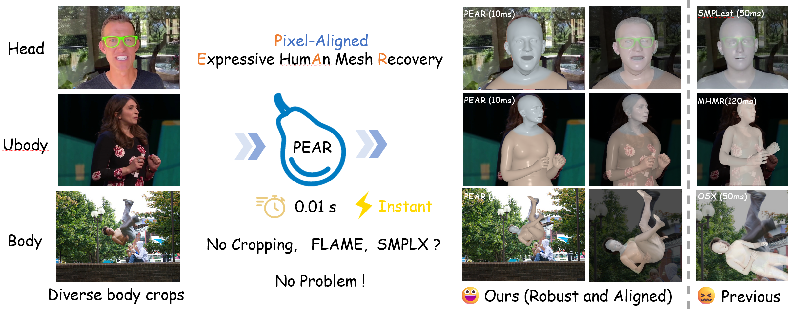
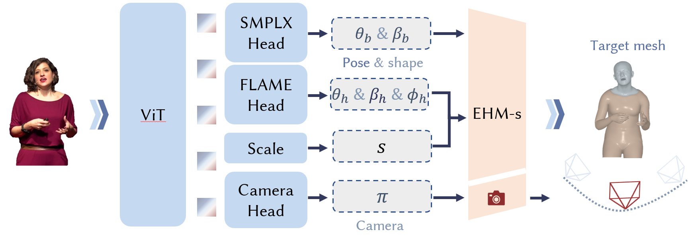

<p align="center">
  <h1 align="center"><strong>   PEAR: Pixel-aligned Expressive humAn mesh Recovery</strong></h1>

<p align="center">
  <a href="https://github.com/WuJH2001">Jiahao Wu</a></sup>,</span> 
  <a href="http://liuyunfei.net/">Yunfei Liu ✉</a></sup>,</span>
  <a href="https://scholar.google.com/citations?hl=en&user=Xf5_TfcAAAAJ">Lijian Lin</a>, 
  <a href="https://scholar.google.com/citations?hl=en&user=qhp9rIMAAAAJ">Ye Zhu</a>, 
  <a> Lei Zhu</a></sup>,
  <a>Jingyi Li</a></sup>,
  <a href="https://yu-li.github.io/">Yu Li</a>
</p>

  <p align="center">
    <em>International Digital Economy Academy (IDEA)</em>
  </p>

</p>

<div id="top" align="center">

[](https://www.arxiv.org/abs/2601.22693)
[](https://wujh2001.github.io/PEAR//)
[](https://www.youtube.com/watch?v=FFnuDwXGA_M)
[](https://huggingface.co/spaces/BestWJH/PEAR)
</div>

<div align="center">
    
</div>


## 📰 News
**[2026.02.02]** Paper release of our PEAR on arXiv!

**[2026.02.02]** The inference code and the **first version of the PEAR model** have been released!  Try it — the model will be downloaded automatically.

**[2026.02.11]** Training code released.

**[TODO]** Training dastasets and **final version of the PEAR model(more accurate in body pose prediction as shown in our paper and project page)**.


## 💡 Overview

<div align="center">
    
</div>

We propose PEAR, a unified framework for real-time expressive 3D human mesh recovery. It is the first method capable of simultaneously predicting EHM-s parameters at 100 FPS.


## ⚡ Quick Start

### 🔧 Preparation

Clone this repository and install the dependencies:

```bash
git clone --recursive https://github.com/Pixel-Talk/PEAR.git
cd PEAR

# The specified PyTorch, Python, and CUDA versions are not strictly required.
# Most compatible configurations should work.
conda create -n pear python=3.9.22
conda activate pear

pip install -r requirements.txt
pip install "git+https://github.com/facebookresearch/pytorch3d.git" --no-build-isolation
pip install chumpy --no-build-isolation
````


- SMPL: Download `SMPL_NEUTRAL.pkl` from [SMPL](https://smpl.is.tue.mpg.de/download.php) and place it in the `assets/SMPL`.
- SMPLX: Download `SMPLX_NEUTRAL_2020.npz` from [SMPLX](https://smpl-x.is.tue.mpg.de/download.php) and place it in the `assets/SMPLX`.
- FLAME: Download the `generic_model.pkl` from [FLAME2020](https://flame.is.tue.mpg.de/download.php). Save this file to both `assets/FLAME/FLAME2020/generic_model.pkl` and `assets/SMPLX/flame_generic_model.pkl`.
- SMPLX2SMPL: unzip `SMPLX2SMPL.zip`.

Or you can download them all at once from this Google Drive [Link](https://drive.google.com/file/d/1HvJ4WljPhEjoVgFBQurGLoKFN9-9UBb0/view) 

```
assets/
├── FLAME/
├── SMPL/
├── SMPLX/
├── SMPLX2SMPL/
├── icons2.png
├── method.png
└── teaser.png
```

---

### ⚡ Inference

All pretrained models will be downloaded automatically.

For video inference, run:

```bash
python app.py
```

For image inference, run:

```bash
python inference_images.py --input_path example/images
```

---

### ⚡ Training

The full training datasets are currently not publicly released.
However, a sample `.tar` file is provided for demonstration purposes.

Download it from
[Google Drive](https://drive.google.com/file/d/1e-lQECHBoDS1dmSXbQjHKZ6qQO_X37ZG/view?usp=drive_link)
and place it under:

```
ehms_datasets/
├── 000000.tar
```

Then run:

```bash
python train_ehms.py -c train -d 0,1,2,3,4,5,6,7  # Adjust according to your available GPUs
```


## 🤗 Citation
If you find this repository useful for your research, please use the following BibTeX entry for citation.

    @misc{wu2026pear,
      title={PEAR: Pixel-aligned Expressive humAn mesh Recovery}, 
      author={Jiahao Wu and Yunfei Liu and Lijian Lin and Ye Zhu and Lei Zhu and Jingyi Li and Yu Li},
      year={2026},
      eprint={2601.22693},
      archivePrefix={arXiv},
      primaryClass={cs.CV},
      url={https://arxiv.org/abs/2601.22693}, 
    }

## Acknowledgements 

We thank the authors of the following works, whose ideas and open-source implementations form the foundation of this project:

[1] FLAME, SMPL-X, SMPL, MANO, HMR2, HSMR, Harmer, HMRPro, SAM3D-Body etc.

[2] SMPLest-X: Ultimate Scaling for Expressive Human Pose and Shape Estimation

[3] Multi-HMR: Multi-Person Whole-Body Human Mesh Recovery in a Single Shot

[4] OSX: One-Stage 3D Whole-Body Mesh Recovery with Component Aware Transformer

[5] AiOS: All-in-One-Stage Expressive Human Pose and Shape Estimation


## License
See the [LICENSE](./LICENSE.txt) file for details about the license under which this code is made available.
